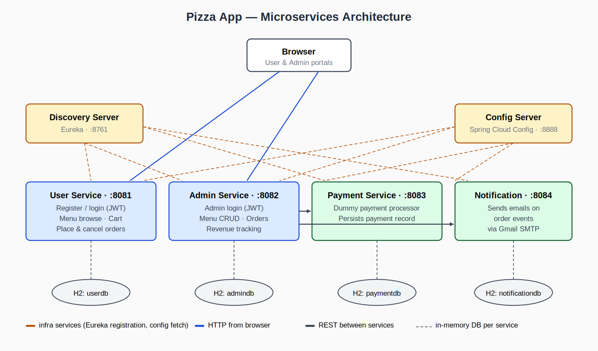

# Pizza App — Spring Boot Microservices

A full-stack pizza ordering system built as a set of Spring Boot microservices, coordinated by Netflix Eureka for service discovery and Spring Cloud Config for centralized configuration. Customers browse a menu, build a cart, and place orders; admins manage the menu and process orders end-to-end; payments and email notifications are dispatched by dedicated services.


---

## Architecture



The system is organized as **four business services** behind **two infrastructure services**:

| Type | Service | Port | Responsibility |
| :--- | :--- | :---: | :--- |
| Infra | `pizza-config-server` | 8888 | Centralized config (Spring Cloud Config, native profile) |
| Infra | `pizza-discovery-server` | 8761 | Service registry (Netflix Eureka) |
| Business | `pizza-user-service` | 8081 | Customer registration, login (JWT), menu browsing, cart, order placement |
| Business | `pizza-admin-service` | 8082 | Admin login (JWT), menu CRUD, order management, revenue tracking |
| Business | `pizza-payment-service` | 8083 | Dummy payment processing, payment record persistence |
| Business | `pizza-notification-service` | 8084 | Email notifications (Gmail SMTP) on order events |

Each business service has its own H2 in-memory database (`userdb`, `admindb`, `paymentdb`, `notificationdb`) — keeping schemas isolated per service is part of why this is a microservice architecture and not a single monolith.

---

## Tech stack

- **Java 17**
- **Spring Boot 3.3.4** — web layer (REST + Thymeleaf), JPA, Security
- **Spring Cloud 2023.0.3** — Eureka discovery, Config server
- **Spring Security + JWT** — separate JWT issuance for customers and admins
- **H2** — in-memory database per service
- **Thymeleaf** — server-rendered HTML for the user and admin portals
- **JavaMailSender + Gmail SMTP** — order-event notifications
- **Maven** — build, one `pom.xml` per service (no parent aggregator)
- **springdoc-openapi** — Swagger UI per REST service

---

## Features

**Customer portal**
- Register, log in (JWT), log out
- Browse menu by category, view item details
- Add items to cart, increase/decrease quantity, remove
- Checkout: place order, pay (dummy), receive email confirmation
- View order history, cancel pending orders, print invoice

**Admin portal**
- Admin login (JWT, separate from customer JWT)
- Menu CRUD: categories and items
- View all customer orders, mark statuses
- Revenue tracking
- Email notifications dispatched automatically on key order events

**Cross-cutting**
- Service-to-service calls routed via Eureka logical names (`http://pizza-admin-service`, etc.) — no hard-coded hostnames in business logic
- Properties fetched at startup from the config server; nothing service-specific is baked into individual service deployments
- Swagger UI on every REST service for live API exploration

---

## Repository layout

```
pizza-app-project/
├── pizza-config-server/        Spring Cloud Config Server (native profile)
│   └── src/main/resources/config/   per-service property files live here
├── pizza-discovery-server/     Netflix Eureka server
├── pizza-user-service/         customer-facing REST + Thymeleaf views
├── pizza-admin-service/        admin REST + Thymeleaf views
├── pizza-payment-service/      payment REST API
├── pizza-notification-service/ notification REST API + Gmail SMTP sender
├── docs/
│   └── assets/architecture.svg architecture diagram (source)
├── .gitignore                  Maven / IDE / secrets
├── LICENSE                     MIT
└── README.md                   you are here
```

---

## Quick start

### Prerequisites

- JDK 17 (`java -version` should show 17.x)
- Maven 3.8+ (or use the included `mvnw` wrapper in each service)
- A Gmail account with an [App Password](https://support.google.com/accounts/answer/185833) if you want notifications to actually send

### 1. Configure secrets (one-time, before first run)

The config server's property files use environment-variable placeholders for any value that shouldn't be in source control. Set these in your shell before starting the services:

```bash
# JWT signing key - generate one with:  openssl rand -hex 32
export JWT_SECRET="<64-char hex string>"

# Gmail credentials for the notification service
export MAIL_USERNAME="your-address@gmail.com"
export MAIL_PASSWORD="your-16-char-gmail-app-password"
```

On Windows PowerShell:

```powershell
$env:JWT_SECRET     = "<64-char hex string>"
$env:MAIL_USERNAME  = "your-address@gmail.com"
$env:MAIL_PASSWORD  = "your-16-char-gmail-app-password"
```

If you don't set `MAIL_USERNAME` / `MAIL_PASSWORD`, the notification service will still start, but actual emails won't send (which is fine for local testing).

### 2. Start services in the right order

The startup order matters — Config Server first (everyone fetches config from it), Eureka second (everyone registers there), then the business services in any order.

```bash
# Terminal 1 - Config Server   :8888
cd pizza-config-server     && ./mvnw spring-boot:run

# Terminal 2 - Discovery       :8761
cd pizza-discovery-server  && ./mvnw spring-boot:run

# Terminals 3-6 - Business services (any order)
cd pizza-user-service          && ./mvnw spring-boot:run    # :8081
cd pizza-admin-service         && ./mvnw spring-boot:run    # :8082
cd pizza-payment-service       && ./mvnw spring-boot:run    # :8083
cd pizza-notification-service  && ./mvnw spring-boot:run    # :8084
```

### 3. Open the portals

| Portal | URL |
| :--- | :--- |
| Customer login | http://localhost:8081/customers/login |
| Customer register | http://localhost:8081/customers/register |
| Admin login | http://localhost:8082/admin/login |
| Eureka dashboard | http://localhost:8761 |

You should see all four business services listed as `UP` in the Eureka dashboard before logging in — that's the fastest health check.

### Demo credentials

The data seeders create one default user and one default admin on first startup of each service:

| Role | Email | Password |
| :--- | :--- | :--- |
| Customer | `user@pizza.com` | `user` |
| Admin | `admin@pizza.com` | `admin` |

These are demo-only seeded accounts for local testing. If you ship this anywhere beyond your laptop, disable or replace the seeders in `UserDataSeeder.java` and `AdminDataSeeder.java`.

---

## API documentation (Swagger UI)

Each REST service exposes its own Swagger UI:

- User Service — http://localhost:8081/swagger-ui/index.html
- Admin Service — http://localhost:8082/swagger-ui/index.html
- Payment Service — http://localhost:8083/swagger-ui/index.html
- Notification Service — http://localhost:8084/swagger-ui/index.html

## H2 consoles

Each service ships its own in-memory database; the consoles are enabled in dev:

| Service | URL | JDBC URL |
| :--- | :--- | :--- |
| User | http://localhost:8081/h2-console | `jdbc:h2:mem:userdb` |
| Admin | http://localhost:8082/h2-console | `jdbc:h2:mem:admindb` |
| Payment | http://localhost:8083/h2-console | `jdbc:h2:mem:paymentdb` |
| Notification | http://localhost:8084/h2-console | `jdbc:h2:mem:notificationdb` |

Login: user `sa`, no password.

---

## Configuration notes

- **All shared config lives in `pizza-config-server/src/main/resources/config/`.** Each service file (e.g. `pizza-user-service.properties`) is loaded by that service at startup via Spring Cloud Config's `native` profile. To tweak ports, JWT settings, or DB URLs, edit those files — *not* the individual service's `application.properties`.
- **Each service's own `application.properties` is intentionally minimal** — it only contains the service name and a pointer to the config server. This is by design: a deployed service should be configured externally, not by what it ships with.
- **JWTs are scoped per audience.** Customer-issued tokens are only accepted by the user service; admin-issued tokens only by the admin service. They share a signing key for simplicity but use separate filters.

---

## What I would build next

- **Replace H2 with PostgreSQL** behind each service. H2 was the right call for a local-only demo, but the moment you want data to survive a restart, the JPA layer needs a real database.
- **Containerize each service** with a Dockerfile + `docker-compose.yml` so the whole stack comes up in one command. The current six-terminal startup is the biggest barrier to evaluating the project quickly.
- **Add an API gateway** (Spring Cloud Gateway) in front of the business services. The browser currently talks directly to user and admin services on different ports; a gateway would route by path under a single origin.
- **Externalize the JWT signing key into a real secret manager** rather than env vars. Env vars are a fine first step; HashiCorp Vault or AWS Secrets Manager would be the production move.
- **Add integration tests with `@SpringBootTest`** that exercise the real REST surface. Unit tests are present; service-to-service contract tests aren't.

---

## License

MIT — see [LICENSE](LICENSE).

## Author

**Netaji Meka** · [nsm325@lehigh.edu](mailto:nsm325@lehigh.edu)
